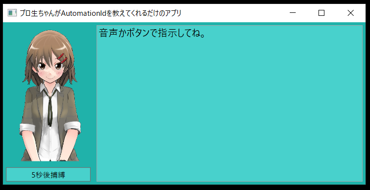
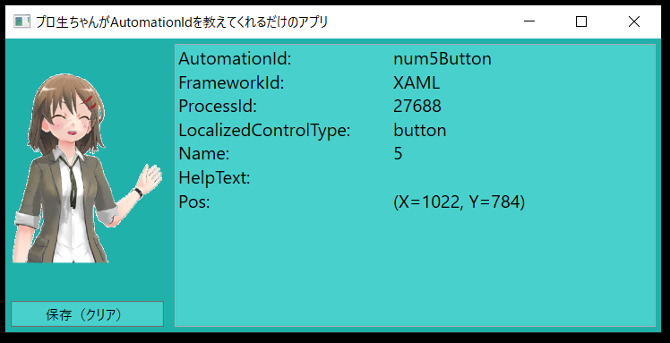

# check_automationID

Sorry. This page is Japanese only.These files are licensed by Pronama LLC.

 * check_automationID\Resources\pronama_result.png
 * check_automationID\Resources\pronama_try.png
 * check_automationID\Resources\puronama_normal.png

    https://kei.pronama.jp/guideline-others/

* You can try this free software, but you will need to take full responsibility for your action.

## これなに？

UIAutomationを使うと、C#やVBあるいはPowerShellでWindowsプログラムを自動実行する事が可能です。本ツールを使うことでその自動化に必要となる情報が収集できます。手っ取り早く言うと、UIAutomationSpyの超絶劣化版ですw

* UIAutomation 本家の説明

    https://docs.microsoft.com/ja-jp/dotnet/framework/ui-automation/ui-automation-overview

自動制御を行う、例えばボタンをクリックさせたい場合には、そのAutomationIdが必要になる場合があります。こういうコードを書く場合ですね。

```cs
var btn = FindElementById(mainForm, _TAREGT_ID)
    .GetCurrentPattern(InvokePattern.Pattern) as InvokePattern;
```

本ツールでは上のコードでいう _TARGE_ID の情報を取得する事が出来ます。

## 動作確認環境など

以下の環境でしか確認はしていません。。

* Windows10 Professional(64bit)
* VisualStdio2019

後必要なものは注意点としまして。

* マイクが必要です（コルタナさんが使える感じにしてもらえれば多分大丈夫）

## ビルド方法

* まずはcloneするなりzipを解凍するなりして、適当なフォルダに展開して下さい。
* で、ビルドするとcheck_automationID.exeが出来ます（Speech系に関するWarningが大量に出ますがすみません放置してます…）
* 必要なファイル構成は以下な感じです。なのでcheck_automationID.exeとResourcesフォルダを並べて使って下さい。

```

check_automationID.exe
│
└─Resources
        pronama_result.png
        pronama_try.png
        puronama_normal.png

```

## 使う際の注意

ウィルス対策ソフトが入っていると、最初の起動が遅かったり、最初だけ音声認識に時間がかかるとかあるようですので、初回の動作は色々と待ってもらえると良いかもです。

後管理者権限の必要なアプリはそのままやるとおそらくダメです。右クリック「管理者として実行」が必要です。

## 使い方

* まずはアプリを起動するとこんな画面がでます。



* データの取り方は２つあるです。

    1. マウスを移動して音声で指示。移動した後、「キャッチ」と叫びますｗ
    1. 「5秒後捕縛」ボタンをクリック後、該当箇所にマウスを移動。5秒ぐらい後にデータを取りにいきます。それまでに移動を完了させて下さい…

* データを取ると以下のような画面に切り替わります。これは電卓の「５」の所にマウスを移動させて取得したデータです。図にある情報が出ます。また位置情報（図のPos）も出してますので、もしも位置を指定して何かしたい場合は参考になるかもです。



* このデータは保存ないし、破棄できます。また、その手続きをしないと次のデータを取ることは出来ません。
* いずれの場合も「保存（クリア）」のボタンをクリックして下さい。保存ファイルの選択画面が出ます。
* C＃風に表現されたテキストデータを保存しますので、適当なファイル名で適当なフォルダに保存して下さい。
* 「Elementのファイルを保存する」（保存ファイルの選択画面）でキャンセルをクリックすればデータは保存せずにクリアします。
* この操作を終えると、起動直後の状態に戻って違うパーツのIDを取りに行くことが可能です。

ちなみに上図のデータを保存するとこういうテキストファイルが出来上がります。

```cs
string AutomationId = "num5Button";
string FrameworkId = "XAML";
int ProcessId = 27688;
string LocalizedControlType = "button";
string Name = "5";
string HelpText = "";
int pX = 1022;
int pY = 784;
```

なので、例えばAutomationIdを使ってボタンをクリックしたいとなると、こういうコードを書けば良いという事になるのです。

```cs
// 「５」のボタンを一回クリックする
string AutomationId = "num5Button";
var btn = FindElementById(mainForm, AutomationId)
    .GetCurrentPattern(InvokePattern.Pattern) as InvokePattern;
btn.Invoke();
```

## 参考にさせて頂いたページ

以下の情報がとてもとても参考になりました。感謝いたします。

* https://tercel-tech.hatenablog.com/entry/2015/04/29/181723
* https://qiita.com/harmegiddo/items/afb8ffb65156d3e9fd84


## ライセンス系について

以下の画像はプロ生ちゃん利用ガイドラインに基づく利用が必要ですのでご注意ください。

* check_automationID\Resources\pronama_result.png
* check_automationID\Resources\pronama_try.png
* check_automationID\Resources\puronama_normal.png

ガイドラインは以下。フリー用途では寛容ですが使う際には一応目を通して下さい。

https://kei.pronama.jp/guideline-others/

コードのライセンスは一応MITとさせて下さい。

## PS

* 当然ですが使用した際の損害は誰も請け負ってくれません。そこだけ注意で。
* 私、普段は組み込みでC系やってますのでC#は素人から毛を抜いたぐらいですので、もろもろお目こぼし戴ければ幸いです。

